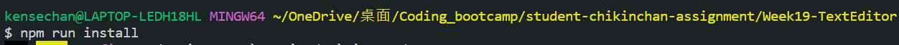
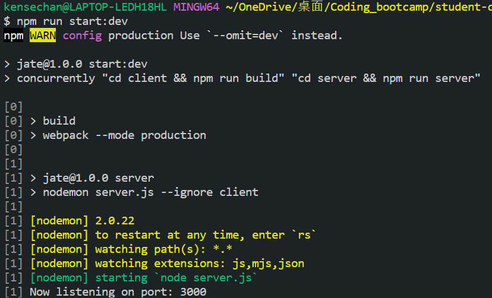

# Progressive Web Applications (PWA): Text Editor

My task is to build a text editor that runs in the browser. The app will be a single-page application that meets the PWA criteria. Additionally, it will feature a number of data persistence techniques that serve as redundancy in case one of the options is not supported by the browser. The application will also function offline.

To build this text editor, I start with an existing application and implement methods for getting and storing data to an IndexedDB database. I use a package called `idb`, which is a lightweight wrapper around the IndexedDB API. It features a number of methods that are useful for storing and retrieving data.

## Functionalities

- When I open my application in my editor, then I should see a client server folder structure
- When I run `npm run start` from the root directory, then I find that my application should start up the backend and serve the client
- When I run the text editor application from my terminal, then I find that my JavaScript files have been bundled using webpack
- When I run my webpack plugins, then I find that I have a generated HTML file, service worker, and a manifest file
- When I use next-gen JavaScript in my application, then I find that the text editor still functions in the browser without errors
- When I open the text editor, then I find that IndexedDB has immediately created a database storage
- When I enter content and subsequently click off of the DOM window, then I find that the content in the text editor has been saved with IndexedDB
- When I reopen the text editor after closing it, then I find that the content in the text editor has been retrieved from our IndexedDB
- When I click on the Install button, then I download my web application as an icon on my desktop
- When I load my web application, then I should have a registered service worker using workbox
- When I register a service worker, then I should have my static assets pre cached upon loading along with subsequent pages and static assets
- When I deploy to Heroku, then I should have proper build scripts for a webpack application

## Files Structure

The files in this app has a client/server structure, as shown below:\

## npm command

- When I run `npm run install`, node modules will be installed.\
  
  

- When I run `npm run start:dev`, dist folder will be created, where the files of the app are bundled.\
  
  

## Running application

- When I run the app in the browser, an indexed DB called 'jate' is created immediately.
  

- When I enter something in the app, the content will be saved after losing focus.
  

- When I reopen the text editor after closing it, then content in the text editor has been retrieved from our IndexedDB

## Install app

- When I click on the 'Install' button in the explorer, the app is installed on the desktop.
  
  
  

## Service worker

- Set the network to be 'offline'. When I refresh the page, the app still work by loading from the cache.
  
  

## Deployment

- Github: [Text Editor (PWA)](https://github.com/cckinwest/Week19-TextEditor-ProgressiveWebApplication)
- Heroku: [Text Editor Progressive WebApp](https://text-editor-progressive-webapp-b38e709de455.herokuapp.com/)
